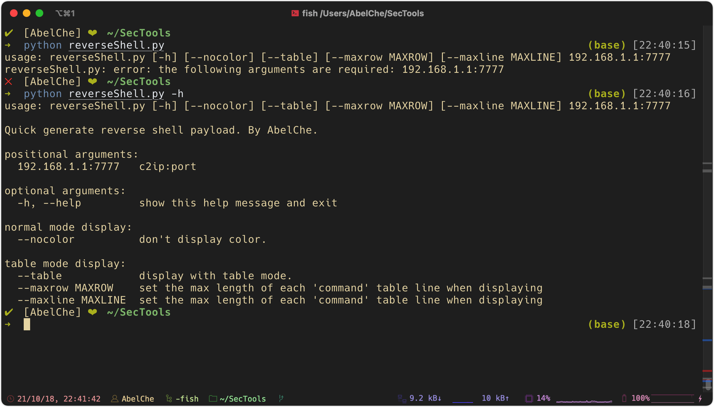
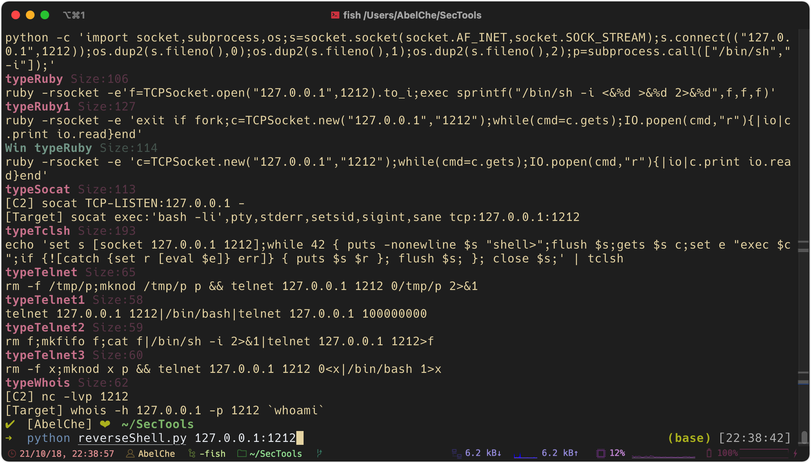
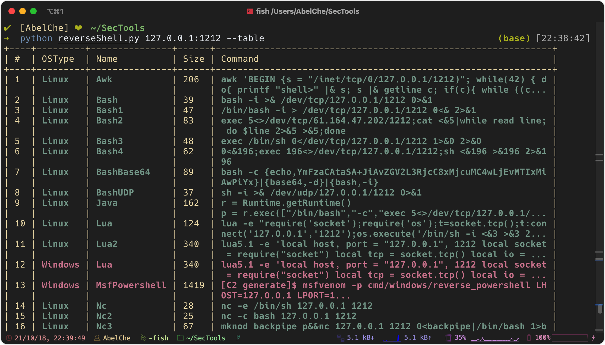
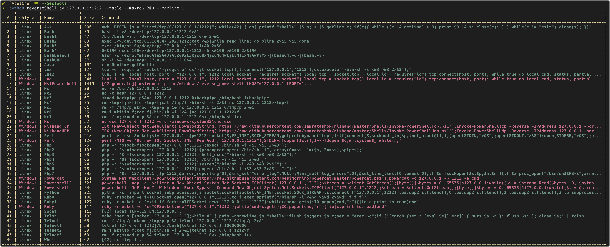
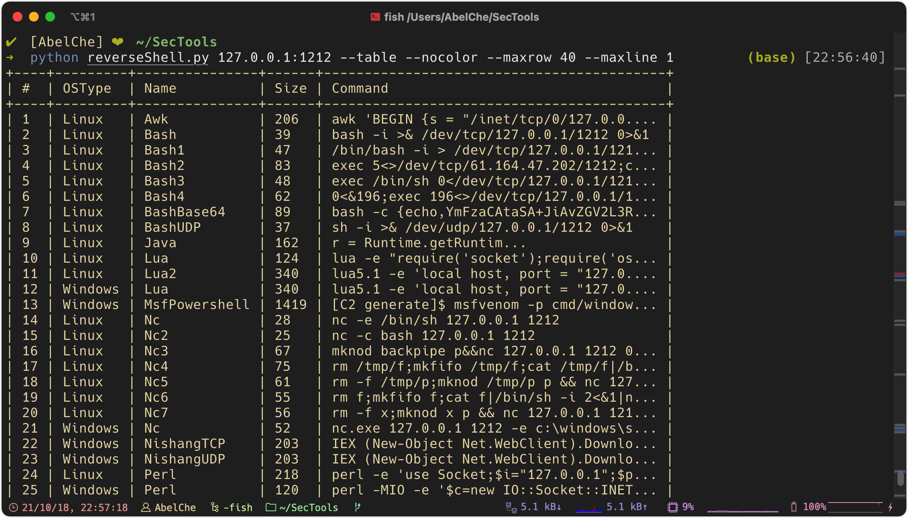
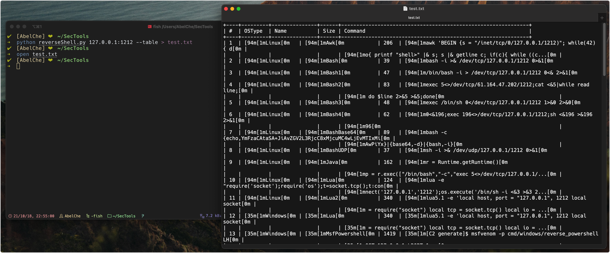
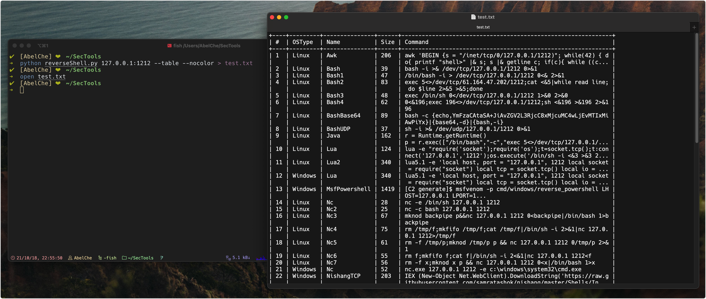

# reverseShellList

```sh
curl https://raw.githubusercontent.com/AbelChe/reverseShellList/main/reverseShell.py > reverseShell.py
python3 reverseShell.py 192.168.12.14:7761
```

if report 'no moudle named prettytable' or 'no module named colorama', just install prettytable and
 colorama.
```sh
pip install prettytable colorama
```

more options see '-h'
```
➜  python reverseShell.py -h                                                               (base) [22:40:16]
usage: reverseShell.py [-h] [--nocolor] [--table] [--maxrow MAXROW] [--maxline MAXLINE] 192.168.1.1:7777

Quick generate reverse shell payload. By AbelChe.

positional arguments:
  192.168.1.1:7777   c2ip:port

optional arguments:
  -h, --help         show this help message and exit

normal mode display:
  --nocolor          don't display color.

table mode display:
  --table            display with table mode.
  --maxrow MAXROW    set the max length of each 'command' table line when displaying
  --maxline MAXLINE  set the max length of each 'command' table line when displaying
```


## Normal Mode
```sh
python reverseShell.py 127.0.0.1:1212
```


## Table Mode
```sh
python reverseShell.py 127.0.0.1:1212 --table
```


And you can set `--maxrow` and `--maxline` to change 'command' display size.
Default row size 60, line size 2
```sh
python reverseShell.py 127.0.0.1:1212 --table --maxrow 200 --maxline 1
```


## No Color Mode
support Normal mode and Table mode.
```sh
python reverseShell.py 127.0.0.1:1212 --table --nocolor --maxrow 40 --maxline 1
```


use --nocolor mode write to file



